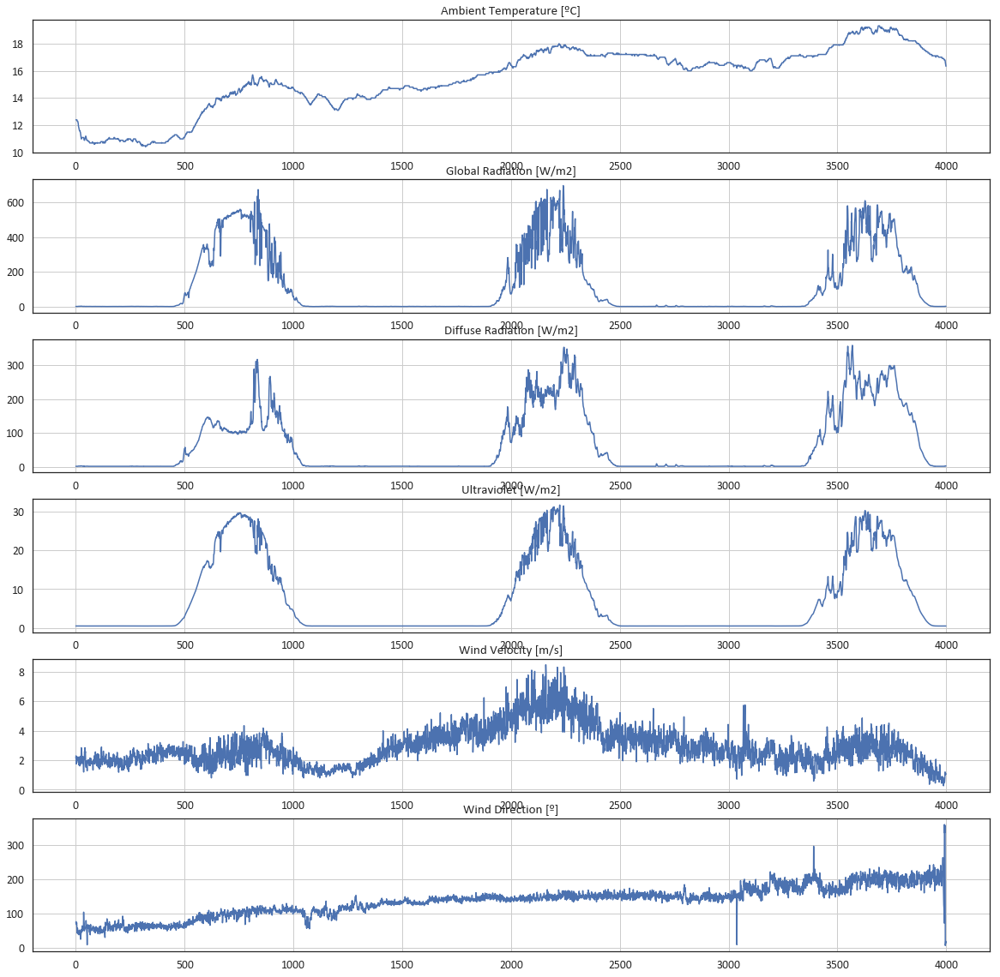

# EDP Open Data SunPower Prediction
##The analytic to participate in the SunPower prediction challenge at EDP Open Data

*TODO: Desciption of the challenge*

Let's first import all the major packages

```python
import warnings 
warnings.filterwarnings(action='ignore')

from pandas import read_csv
import pandas as pd
import numpy as np
from matplotlib import pyplot
%matplotlib inline

import locale
#locale.setlocale(locale.LC_ALL, 'pt_PT')

from glob import iglob

from sklearn import datasets, linear_model
from sklearn.metrics import mean_squared_error, r2_score
from sklearn.model_selection import train_test_split

import seaborn as sns
sns.set(style='white', palette='deep', font_scale=1.25, font='calibri
```

It will be helpfull the plot the different 'channels' in order to visualy inspect what is going on

```python
def plot_channels (dataset, plot_type, min_range = 0, max_range = 100):
    #plot all channels
    n_channels = len(dataset.columns)
    pyplot.figure(figsize=(20,20))
    for i in range (n_channels):
        pyplot.subplot(n_channels, 1, i+1)
        pyplot.title(dataset.columns[i], y=1)
        if plot_type == 'line':
            pyplot.plot(dataset.iloc[min_range:max_range,i].values)
        elif plot_type == 'hist':
            pyplot.hist(dataset.iloc[:,i].values, bins = 100)
        pyplot.grid()
    pyplot.show()
```

```python    
# split a univariate sequence into samples
def to_supervised(sequence, n_steps_1, n_output = 1, n_steps_2 = 0):
    X, y = list(), list()
    for i in range(len(sequence)):
        # find the end of this pattern
        end_ix_1 = i + n_steps_1
        stard_ix_2 = end_ix_1 + n_steps_2
        end_ix_2 = stard_ix_2 + n_output
        
        #print(n_steps_1, n_output, n_steps_2)
        #print(end_ix_1, stard_ix_2, end_ix_2)
        
        # check if we are beyond the sequence
        if (end_ix_2 - 1) > len(sequence)-1:
            break
        # gather input and output parts of the pattern
        seq_x, seq_y = sequence[i:end_ix_1], sequence[stard_ix_2:end_ix_2]
        X.append(seq_x)
        y.append(seq_y)
    return np.array(X), np.array(y)

sample_rule = '5T'
```


```python
from glob import iglob
path = r'sunlab-faro-meteo*2017.csv'
all_rec = iglob(path, recursive=True)     
batch = (pd.read_csv(f, sep =";", decimal='.',index_col=0, parse_dates=True) for f in all_rec)
meteo_data = pd.concat(batch)
#sort the index
meteo_data.sort_index(inplace=True)
#show first and last rows

#meteo_data_raw.head()
#meteo_data_raw.tail()

print('Total lines:', len(meteo_data)) 
print(meteo_data.count())

```

    Total lines: 524890
    Ambient Temperature [ºC]      524890
    Global Radiation [W/m2]       524890
    Diffuse Radiation [W/m2]      524890
    Ultraviolet [W/m2]            524890
    Wind Velocity [m/s]           524890
    Wind Direction [º]            524890
    Precipitation [mm]            524890
    Atmospheric pressure [hPa]    524890
    dtype: int64
    


```python
meteo_data.describe()
```


<div>
<style scoped>
    .dataframe tbody tr th:only-of-type {
        vertical-align: middle;
    }

    .dataframe tbody tr th {
        vertical-align: top;
    }

    .dataframe thead th {
        text-align: right;
    }
</style>
<table border="1" class="dataframe">
  <thead>
    <tr style="text-align: right;">
      <th></th>
      <th>Ambient Temperature [ºC]</th>
      <th>Global Radiation [W/m2]</th>
      <th>Diffuse Radiation [W/m2]</th>
      <th>Ultraviolet [W/m2]</th>
      <th>Wind Velocity [m/s]</th>
      <th>Wind Direction [º]</th>
      <th>Precipitation [mm]</th>
      <th>Atmospheric pressure [hPa]</th>
    </tr>
  </thead>
  <tbody>
    <tr>
      <th>count</th>
      <td>5.248900e+05</td>
      <td>524890.000000</td>
      <td>524890.000000</td>
      <td>524890.000000</td>
      <td>5.248900e+05</td>
      <td>524890.000000</td>
      <td>524890.000000</td>
      <td>5.248900e+05</td>
    </tr>
    <tr>
      <th>mean</th>
      <td>-5.696618e+03</td>
      <td>229.720337</td>
      <td>63.373129</td>
      <td>13.937115</td>
      <td>-5.713284e+03</td>
      <td>206.477602</td>
      <td>0.000697</td>
      <td>-4.699446e+03</td>
    </tr>
    <tr>
      <th>std</th>
      <td>2.928004e+06</td>
      <td>315.990218</td>
      <td>92.295267</td>
      <td>18.942142</td>
      <td>2.928004e+06</td>
      <td>104.699963</td>
      <td>0.015156</td>
      <td>2.928004e+06</td>
    </tr>
    <tr>
      <th>min</th>
      <td>-1.500000e+09</td>
      <td>0.731202</td>
      <td>1.590219</td>
      <td>0.497415</td>
      <td>-1.500000e+09</td>
      <td>0.000000</td>
      <td>0.000000</td>
      <td>-1.499999e+09</td>
    </tr>
    <tr>
      <th>25%</th>
      <td>1.460000e+01</td>
      <td>1.561721</td>
      <td>1.701220</td>
      <td>0.510380</td>
      <td>1.233333e+00</td>
      <td>111.671125</td>
      <td>0.000000</td>
      <td>1.012583e+03</td>
    </tr>
    <tr>
      <th>50%</th>
      <td>1.870000e+01</td>
      <td>8.294550</td>
      <td>7.991071</td>
      <td>1.088642</td>
      <td>2.066667e+00</td>
      <td>231.518870</td>
      <td>0.000000</td>
      <td>1.015483e+03</td>
    </tr>
    <tr>
      <th>75%</th>
      <td>2.330000e+01</td>
      <td>442.262700</td>
      <td>96.588342</td>
      <td>25.079519</td>
      <td>2.950000e+00</td>
      <td>304.295110</td>
      <td>0.000000</td>
      <td>1.019000e+03</td>
    </tr>
    <tr>
      <th>max</th>
      <td>3.790000e+01</td>
      <td>1484.379800</td>
      <td>715.146720</td>
      <td>85.515376</td>
      <td>1.165000e+01</td>
      <td>359.999280</td>
      <td>2.030000</td>
      <td>1.035900e+03</td>
    </tr>
  </tbody>
</table>
</div>


```python
#hours = meteo_data[meteo_data['Diffuse Radiation [W/m2]'].isna() == True].index.strftime('%H')
#hours = np.array(hours)
#hours = hours.astype(np.int)
```


```python
meteo_data.drop(columns=['Atmospheric pressure [hPa]', 'Precipitation [mm]'], inplace = True)
print(meteo_data.count())
meteo_data.describe()
```

    Ambient Temperature [ºC]    524890
    Global Radiation [W/m2]     524890
    Diffuse Radiation [W/m2]    524890
    Ultraviolet [W/m2]          524890
    Wind Velocity [m/s]         524890
    Wind Direction [º]          524890
    dtype: int64
    


<div>
<style scoped>
    .dataframe tbody tr th:only-of-type {
        vertical-align: middle;
    }

    .dataframe tbody tr th {
        vertical-align: top;
    }

    .dataframe thead th {
        text-align: right;
    }
</style>
<table border="1" class="dataframe">
  <thead>
    <tr style="text-align: right;">
      <th></th>
      <th>Ambient Temperature [ºC]</th>
      <th>Global Radiation [W/m2]</th>
      <th>Diffuse Radiation [W/m2]</th>
      <th>Ultraviolet [W/m2]</th>
      <th>Wind Velocity [m/s]</th>
      <th>Wind Direction [º]</th>
    </tr>
  </thead>
  <tbody>
    <tr>
      <th>count</th>
      <td>5.248900e+05</td>
      <td>524890.000000</td>
      <td>524890.000000</td>
      <td>524890.000000</td>
      <td>5.248900e+05</td>
      <td>524890.000000</td>
    </tr>
    <tr>
      <th>mean</th>
      <td>-5.696618e+03</td>
      <td>229.720337</td>
      <td>63.373129</td>
      <td>13.937115</td>
      <td>-5.713284e+03</td>
      <td>206.477602</td>
    </tr>
    <tr>
      <th>std</th>
      <td>2.928004e+06</td>
      <td>315.990218</td>
      <td>92.295267</td>
      <td>18.942142</td>
      <td>2.928004e+06</td>
      <td>104.699963</td>
    </tr>
    <tr>
      <th>min</th>
      <td>-1.500000e+09</td>
      <td>0.731202</td>
      <td>1.590219</td>
      <td>0.497415</td>
      <td>-1.500000e+09</td>
      <td>0.000000</td>
    </tr>
    <tr>
      <th>25%</th>
      <td>1.460000e+01</td>
      <td>1.561721</td>
      <td>1.701220</td>
      <td>0.510380</td>
      <td>1.233333e+00</td>
      <td>111.671125</td>
    </tr>
    <tr>
      <th>50%</th>
      <td>1.870000e+01</td>
      <td>8.294550</td>
      <td>7.991071</td>
      <td>1.088642</td>
      <td>2.066667e+00</td>
      <td>231.518870</td>
    </tr>
    <tr>
      <th>75%</th>
      <td>2.330000e+01</td>
      <td>442.262700</td>
      <td>96.588342</td>
      <td>25.079519</td>
      <td>2.950000e+00</td>
      <td>304.295110</td>
    </tr>
    <tr>
      <th>max</th>
      <td>3.790000e+01</td>
      <td>1484.379800</td>
      <td>715.146720</td>
      <td>85.515376</td>
      <td>1.165000e+01</td>
      <td>359.999280</td>
    </tr>
  </tbody>
</table>
</div>


```python
#fill in Precipitation with 0
#meteo_data['Precipitation'] = meteo_data['Precipitation [mm]'].replace(np.nan, 0)
#meteo_data[6].fillna(0, inplace=False)

#fill in Atm pressure with 1013 hPa
#meteo_data['Atmospheric pressure [hPa]'].replace(to_replace = np.nan, value= 1013.2, inplace = True)

#fill in Global Radiation [W/m2] with 0 (every NaN at night-time)
#meteo_data['Global Radiation [W/m2]'] = meteo_data['Global Radiation [W/m2]'].replace(np.nan, 0)

#fill in Direct Radiation [W/m2] with 0 (every NaN at night-time)
#meteo_data['Direct Radiation [W/m2]'] = meteo_data['Direct Radiation [W/m2]'].replace(np.nan, 0)

#meteo_data.describe()
```


```python
#meteo_data_clean[meteo_data_clean['Global Radiation [W/m2]'].isna()]
```


```python
#replace outliers with average x-1, x+1
def replace_outliers_mean(dataset, columns, threshold):
    for col in columns:
        print ('Fixing', col)
        i = 0
        while  dataset[col].min() < threshold:
            aux = dataset[col].min()
            indx = np.where(dataset[col] == aux)[0][0]
            avr = (dataset[col].iloc[indx-1] + dataset[col].iloc[indx+1])/2
            dataset[col].iloc[indx] = avr
            i = i + 1
        print('Fixed', i, 'values')

replace_outliers_mean(meteo_data, ['Ambient Temperature [ºC]', 'Wind Velocity [m/s]']  , -100)
#check if everything is ok
meteo_data.describe()
```

    Fixing Ambient Temperature [ºC]
    Fixed 2 values
    Fixing Wind Velocity [m/s]
    Fixed 2 values
    


<div>
<style scoped>
    .dataframe tbody tr th:only-of-type {
        vertical-align: middle;
    }

    .dataframe tbody tr th {
        vertical-align: top;
    }

    .dataframe thead th {
        text-align: right;
    }
</style>
<table border="1" class="dataframe">
  <thead>
    <tr style="text-align: right;">
      <th></th>
      <th>Ambient Temperature [ºC]</th>
      <th>Global Radiation [W/m2]</th>
      <th>Diffuse Radiation [W/m2]</th>
      <th>Ultraviolet [W/m2]</th>
      <th>Wind Velocity [m/s]</th>
      <th>Wind Direction [º]</th>
    </tr>
  </thead>
  <tbody>
    <tr>
      <th>count</th>
      <td>524890.000000</td>
      <td>524890.000000</td>
      <td>524890.000000</td>
      <td>524890.000000</td>
      <td>524890.000000</td>
      <td>524890.000000</td>
    </tr>
    <tr>
      <th>mean</th>
      <td>18.865660</td>
      <td>229.720337</td>
      <td>63.373129</td>
      <td>13.937115</td>
      <td>2.199175</td>
      <td>206.477602</td>
    </tr>
    <tr>
      <th>std</th>
      <td>5.963428</td>
      <td>315.990218</td>
      <td>92.295267</td>
      <td>18.942142</td>
      <td>1.248139</td>
      <td>104.699963</td>
    </tr>
    <tr>
      <th>min</th>
      <td>1.700000</td>
      <td>0.731202</td>
      <td>1.590219</td>
      <td>0.497415</td>
      <td>0.000000</td>
      <td>0.000000</td>
    </tr>
    <tr>
      <th>25%</th>
      <td>14.600000</td>
      <td>1.561721</td>
      <td>1.701220</td>
      <td>0.510380</td>
      <td>1.233333</td>
      <td>111.671125</td>
    </tr>
    <tr>
      <th>50%</th>
      <td>18.699998</td>
      <td>8.294550</td>
      <td>7.991071</td>
      <td>1.088642</td>
      <td>2.066667</td>
      <td>231.518870</td>
    </tr>
    <tr>
      <th>75%</th>
      <td>23.300002</td>
      <td>442.262700</td>
      <td>96.588342</td>
      <td>25.079519</td>
      <td>2.950000</td>
      <td>304.295110</td>
    </tr>
    <tr>
      <th>max</th>
      <td>37.899996</td>
      <td>1484.379800</td>
      <td>715.146720</td>
      <td>85.515376</td>
      <td>11.650000</td>
      <td>359.999280</td>
    </tr>
  </tbody>
</table>
</div>


```python
plot_channels (meteo_data, plot_type= 'line' , min_range=0, max_range=4000)
```





```python
plot_channels (meteo_data, plot_type= 'hist')
```


```python
meteo_data_h = meteo_data.resample(rule=sample_rule).mean()
meteo_data_h.head()
meteo_data_h.describe()
```


<div>
<style scoped>
    .dataframe tbody tr th:only-of-type {
        vertical-align: middle;
    }

    .dataframe tbody tr th {
        vertical-align: top;
    }

    .dataframe thead th {
        text-align: right;
    }
</style>
<table border="1" class="dataframe">
  <thead>
    <tr style="text-align: right;">
      <th></th>
      <th>Ambient Temperature [ºC]</th>
      <th>Global Radiation [W/m2]</th>
      <th>Diffuse Radiation [W/m2]</th>
      <th>Ultraviolet [W/m2]</th>
      <th>Wind Velocity [m/s]</th>
      <th>Wind Direction [º]</th>
    </tr>
  </thead>
  <tbody>
    <tr>
      <th>count</th>
      <td>104976.000000</td>
      <td>104976.000000</td>
      <td>104976.000000</td>
      <td>104976.000000</td>
      <td>104976.000000</td>
      <td>104976.000000</td>
    </tr>
    <tr>
      <th>mean</th>
      <td>18.866242</td>
      <td>229.725671</td>
      <td>63.374802</td>
      <td>13.937429</td>
      <td>2.199210</td>
      <td>206.477384</td>
    </tr>
    <tr>
      <th>std</th>
      <td>5.962977</td>
      <td>315.066211</td>
      <td>92.112668</td>
      <td>18.916321</td>
      <td>1.184391</td>
      <td>96.547269</td>
    </tr>
    <tr>
      <th>min</th>
      <td>1.720000</td>
      <td>0.747142</td>
      <td>1.603289</td>
      <td>0.499344</td>
      <td>0.000000</td>
      <td>0.000000</td>
    </tr>
    <tr>
      <th>25%</th>
      <td>14.596667</td>
      <td>1.565231</td>
      <td>1.715743</td>
      <td>0.509966</td>
      <td>1.270000</td>
      <td>116.504285</td>
    </tr>
    <tr>
      <th>50%</th>
      <td>18.709999</td>
      <td>8.321189</td>
      <td>7.966659</td>
      <td>1.093469</td>
      <td>2.103334</td>
      <td>227.552644</td>
    </tr>
    <tr>
      <th>75%</th>
      <td>23.296667</td>
      <td>443.879820</td>
      <td>96.653135</td>
      <td>25.197286</td>
      <td>2.930000</td>
      <td>297.343515</td>
    </tr>
    <tr>
      <th>max</th>
      <td>37.730001</td>
      <td>1229.890320</td>
      <td>691.859056</td>
      <td>74.659562</td>
      <td>9.186668</td>
      <td>357.234928</td>
    </tr>
  </tbody>
</table>
</div>


```python
feature = 'Wind Velocity [m/s]'
pyplot.figure(figsize=(20,10))
pyplot.plot(meteo_data[feature]['2017-01-01'])
pyplot.plot(meteo_data_h[feature]['2017-01-01'], color = 'r')
pyplot.show()
```


```python
print(len(meteo_data_h))
meteo_data_h.count()
print(meteo_data_h.isna().sum())
meteo_data_h.dropna(inplace=True)
print(meteo_data_h.isna().sum())

```

    105109
    Ambient Temperature [ºC]    133
    Global Radiation [W/m2]     133
    Diffuse Radiation [W/m2]    133
    Ultraviolet [W/m2]          133
    Wind Velocity [m/s]         133
    Wind Direction [º]          133
    dtype: int64
    Ambient Temperature [ºC]    0
    Global Radiation [W/m2]     0
    Diffuse Radiation [W/m2]    0
    Ultraviolet [W/m2]          0
    Wind Velocity [m/s]         0
    Wind Direction [º]          0
    dtype: int64
    


```python
#meteo_data_h.drop(columns=['Ambient Temperature [ºC]','Wind Velocity [m/s]','Wind Direction [º]'], inplace= True)
#meteo_data_h.head()
```


```python
meteo_data_h.describe()
```


<div>
<style scoped>
    .dataframe tbody tr th:only-of-type {
        vertical-align: middle;
    }

    .dataframe tbody tr th {
        vertical-align: top;
    }

    .dataframe thead th {
        text-align: right;
    }
</style>
<table border="1" class="dataframe">
  <thead>
    <tr style="text-align: right;">
      <th></th>
      <th>Ambient Temperature [ºC]</th>
      <th>Global Radiation [W/m2]</th>
      <th>Diffuse Radiation [W/m2]</th>
      <th>Ultraviolet [W/m2]</th>
      <th>Wind Velocity [m/s]</th>
      <th>Wind Direction [º]</th>
    </tr>
  </thead>
  <tbody>
    <tr>
      <th>count</th>
      <td>104976.000000</td>
      <td>104976.000000</td>
      <td>104976.000000</td>
      <td>104976.000000</td>
      <td>104976.000000</td>
      <td>104976.000000</td>
    </tr>
    <tr>
      <th>mean</th>
      <td>18.866242</td>
      <td>229.725671</td>
      <td>63.374802</td>
      <td>13.937429</td>
      <td>2.199210</td>
      <td>206.477384</td>
    </tr>
    <tr>
      <th>std</th>
      <td>5.962977</td>
      <td>315.066211</td>
      <td>92.112668</td>
      <td>18.916321</td>
      <td>1.184391</td>
      <td>96.547269</td>
    </tr>
    <tr>
      <th>min</th>
      <td>1.720000</td>
      <td>0.747142</td>
      <td>1.603289</td>
      <td>0.499344</td>
      <td>0.000000</td>
      <td>0.000000</td>
    </tr>
    <tr>
      <th>25%</th>
      <td>14.596667</td>
      <td>1.565231</td>
      <td>1.715743</td>
      <td>0.509966</td>
      <td>1.270000</td>
      <td>116.504285</td>
    </tr>
    <tr>
      <th>50%</th>
      <td>18.709999</td>
      <td>8.321189</td>
      <td>7.966659</td>
      <td>1.093469</td>
      <td>2.103334</td>
      <td>227.552644</td>
    </tr>
    <tr>
      <th>75%</th>
      <td>23.296667</td>
      <td>443.879820</td>
      <td>96.653135</td>
      <td>25.197286</td>
      <td>2.930000</td>
      <td>297.343515</td>
    </tr>
    <tr>
      <th>max</th>
      <td>37.730001</td>
      <td>1229.890320</td>
      <td>691.859056</td>
      <td>74.659562</td>
      <td>9.186668</td>
      <td>357.234928</td>
    </tr>
  </tbody>
</table>
</div>


```python
plot_channels (meteo_data_h, plot_type= 'line' , min_range=0, max_range=2000)
```


```python
## PV data
```


```python
path = r'sunlab-faro-pv*2017.csv'
all_rec = iglob(path, recursive=True)     
batch = (pd.read_csv(f, sep =";", decimal='.',index_col=0, parse_dates = True) for f in all_rec)
pv_data_raw = pd.concat(batch)
#sort the index
pv_data_raw.sort_index(inplace=True)
#show first and last rows
#pv_data_raw.head()
#pv_data_raw.tail()
```


```python
pv_data_opt_panel_b = pv_data_raw[['B_Optimal - Power DC [W]']]
pv_data_opt_panel_b.head()
```


<div>
<style scoped>
    .dataframe tbody tr th:only-of-type {
        vertical-align: middle;
    }

    .dataframe tbody tr th {
        vertical-align: top;
    }

    .dataframe thead th {
        text-align: right;
    }
</style>
<table border="1" class="dataframe">
  <thead>
    <tr style="text-align: right;">
      <th></th>
      <th>B_Optimal - Power DC [W]</th>
    </tr>
    <tr>
      <th>Datetime</th>
      <th></th>
    </tr>
  </thead>
  <tbody>
    <tr>
      <th>2017-01-20 07:44:00</th>
      <td>NaN</td>
    </tr>
    <tr>
      <th>2017-01-20 07:45:00</th>
      <td>NaN</td>
    </tr>
    <tr>
      <th>2017-01-20 07:46:00</th>
      <td>NaN</td>
    </tr>
    <tr>
      <th>2017-01-20 07:47:00</th>
      <td>NaN</td>
    </tr>
    <tr>
      <th>2017-01-20 07:48:00</th>
      <td>NaN</td>
    </tr>
  </tbody>
</table>
</div>


```python
#drop NAN from dataset
print(pv_data_opt_panel_b.isna().sum())
pv_data_opt_panel_b.dropna(inplace=True)
print(pv_data_opt_panel_b.isna().sum())

print(len(pv_data_opt_panel_b))
pv_data_opt_panel_b.count()
```

    B_Optimal - Power DC [W]    4313
    dtype: int64
    B_Optimal - Power DC [W]    0
    dtype: int64
    202646
    


    B_Optimal - Power DC [W]    202646
    dtype: int64


```python
pv_data_opt_panel_b_h = pv_data_opt_panel_b.resample(rule = sample_rule).mean()
pv_data_opt_panel_b_h.tail()

```


<div>
<style scoped>
    .dataframe tbody tr th:only-of-type {
        vertical-align: middle;
    }

    .dataframe tbody tr th {
        vertical-align: top;
    }

    .dataframe thead th {
        text-align: right;
    }
</style>
<table border="1" class="dataframe">
  <thead>
    <tr style="text-align: right;">
      <th></th>
      <th>B_Optimal - Power DC [W]</th>
    </tr>
    <tr>
      <th>Datetime</th>
      <th></th>
    </tr>
  </thead>
  <tbody>
    <tr>
      <th>2017-12-31 16:40:00</th>
      <td>6.791750</td>
    </tr>
    <tr>
      <th>2017-12-31 16:45:00</th>
      <td>1.892125</td>
    </tr>
    <tr>
      <th>2017-12-31 16:50:00</th>
      <td>0.977225</td>
    </tr>
    <tr>
      <th>2017-12-31 16:55:00</th>
      <td>0.816000</td>
    </tr>
    <tr>
      <th>2017-12-31 17:00:00</th>
      <td>0.844425</td>
    </tr>
  </tbody>
</table>
</div>


```python
#drop NAN from dataset
print(pv_data_opt_panel_b_h.isna().sum())
pv_data_opt_panel_b_h.dropna(inplace=True)
print(pv_data_opt_panel_b_h.isna().sum())

print(len(pv_data_opt_panel_b_h))
pv_data_opt_panel_b_h.count()
```

    B_Optimal - Power DC [W]    58459
    dtype: int64
    B_Optimal - Power DC [W]    0
    dtype: int64
    41012
    


    B_Optimal - Power DC [W]    41012
    dtype: int64


```python
## MERGE THE 2 DATASETS
```


```python
xx = pv_data_opt_panel_b_h['2017-01-20']
yy = meteo_data_h['2017-01-20']
zz = pd.merge(xx, yy, left_index=True, right_index=True, how = 'outer')
pyplot.plot(zz)
pyplot.show()
```


```python
full_data_h = pd.merge(pv_data_opt_panel_b_h, meteo_data_h, left_index=True, right_index= True)
full_data_h.dropna(inplace=True)
full_data_h.describe()
```


<div>
<style scoped>
    .dataframe tbody tr th:only-of-type {
        vertical-align: middle;
    }

    .dataframe tbody tr th {
        vertical-align: top;
    }

    .dataframe thead th {
        text-align: right;
    }
</style>
<table border="1" class="dataframe">
  <thead>
    <tr style="text-align: right;">
      <th></th>
      <th>B_Optimal - Power DC [W]</th>
      <th>Ambient Temperature [ºC]</th>
      <th>Global Radiation [W/m2]</th>
      <th>Diffuse Radiation [W/m2]</th>
      <th>Ultraviolet [W/m2]</th>
      <th>Wind Velocity [m/s]</th>
      <th>Wind Direction [º]</th>
    </tr>
  </thead>
  <tbody>
    <tr>
      <th>count</th>
      <td>41012.000000</td>
      <td>41012.000000</td>
      <td>41012.000000</td>
      <td>41012.000000</td>
      <td>41012.000000</td>
      <td>41012.000000</td>
      <td>41012.000000</td>
    </tr>
    <tr>
      <th>mean</th>
      <td>99.169925</td>
      <td>21.383457</td>
      <td>460.285200</td>
      <td>128.596991</td>
      <td>27.647420</td>
      <td>2.643914</td>
      <td>191.038086</td>
    </tr>
    <tr>
      <th>std</th>
      <td>71.097567</td>
      <td>5.586372</td>
      <td>320.972623</td>
      <td>104.164556</td>
      <td>19.639714</td>
      <td>1.171847</td>
      <td>80.882944</td>
    </tr>
    <tr>
      <th>min</th>
      <td>0.000000</td>
      <td>3.046667</td>
      <td>0.747142</td>
      <td>1.641721</td>
      <td>0.502618</td>
      <td>0.000000</td>
      <td>0.000000</td>
    </tr>
    <tr>
      <th>25%</th>
      <td>26.464831</td>
      <td>16.970000</td>
      <td>167.865223</td>
      <td>60.290278</td>
      <td>10.098970</td>
      <td>1.816667</td>
      <td>118.751942</td>
    </tr>
    <tr>
      <th>50%</th>
      <td>99.324962</td>
      <td>21.436666</td>
      <td>444.522732</td>
      <td>98.841058</td>
      <td>25.478988</td>
      <td>2.600000</td>
      <td>201.842600</td>
    </tr>
    <tr>
      <th>75%</th>
      <td>168.132587</td>
      <td>25.926666</td>
      <td>727.343412</td>
      <td>173.423178</td>
      <td>43.598343</td>
      <td>3.376667</td>
      <td>256.007464</td>
    </tr>
    <tr>
      <th>max</th>
      <td>259.751975</td>
      <td>37.730001</td>
      <td>1229.890320</td>
      <td>691.859056</td>
      <td>74.659562</td>
      <td>9.053334</td>
      <td>356.394032</td>
    </tr>
  </tbody>
</table>
</div>


```python
full_data_h.head()
```


<div>
<style scoped>
    .dataframe tbody tr th:only-of-type {
        vertical-align: middle;
    }

    .dataframe tbody tr th {
        vertical-align: top;
    }

    .dataframe thead th {
        text-align: right;
    }
</style>
<table border="1" class="dataframe">
  <thead>
    <tr style="text-align: right;">
      <th></th>
      <th>B_Optimal - Power DC [W]</th>
      <th>Ambient Temperature [ºC]</th>
      <th>Global Radiation [W/m2]</th>
      <th>Diffuse Radiation [W/m2]</th>
      <th>Ultraviolet [W/m2]</th>
      <th>Wind Velocity [m/s]</th>
      <th>Wind Direction [º]</th>
    </tr>
    <tr>
      <th>Datetime</th>
      <th></th>
      <th></th>
      <th></th>
      <th></th>
      <th></th>
      <th></th>
      <th></th>
    </tr>
  </thead>
  <tbody>
    <tr>
      <th>2017-01-20 07:50:00</th>
      <td>1.426025</td>
      <td>4.933333</td>
      <td>7.314926</td>
      <td>6.993808</td>
      <td>1.355659</td>
      <td>3.726667</td>
      <td>328.863260</td>
    </tr>
    <tr>
      <th>2017-01-20 07:55:00</th>
      <td>9.514437</td>
      <td>5.090000</td>
      <td>13.976387</td>
      <td>10.795062</td>
      <td>1.696779</td>
      <td>4.280000</td>
      <td>332.257972</td>
    </tr>
    <tr>
      <th>2017-01-20 08:00:00</th>
      <td>18.677300</td>
      <td>5.373333</td>
      <td>21.912947</td>
      <td>13.608651</td>
      <td>2.094327</td>
      <td>4.003334</td>
      <td>334.100764</td>
    </tr>
    <tr>
      <th>2017-01-20 08:05:00</th>
      <td>26.222300</td>
      <td>5.553333</td>
      <td>31.228082</td>
      <td>16.926768</td>
      <td>2.524696</td>
      <td>4.046667</td>
      <td>329.963056</td>
    </tr>
    <tr>
      <th>2017-01-20 08:10:00</th>
      <td>32.793950</td>
      <td>5.776667</td>
      <td>42.421510</td>
      <td>19.938563</td>
      <td>2.991913</td>
      <td>3.920000</td>
      <td>326.865276</td>
    </tr>
  </tbody>
</table>
</div>


```python
plot_channels (full_data_h, plot_type= 'line' , min_range=0, max_range=500)
```


```python
import seaborn as sns
sns.set(style="ticks")
sns.pairplot(full_data_h)
pyplot.show()
```


```python
# checking multicolinearity

import numpy as np
import pandas as pd
import time
from statsmodels.stats.outliers_influence import variance_inflation_factor    
from joblib import Parallel, delayed

# Defining the function that you will run later
def calculate_vif_(X, thresh=5.0):
    variables = [X.columns[i] for i in range(X.shape[1])]
    dropped=True
    while dropped:
        dropped=False
        print(len(variables))
        vif = Parallel(n_jobs=-1,verbose=5)(delayed(variance_inflation_factor)(X[variables].values, ix) for ix in range(len(variables)))

        maxloc = vif.index(max(vif))
        if max(vif) > thresh:
            print(time.ctime() + ' dropping \'' + X[variables].columns[maxloc] + '\' at index: ' + str(maxloc))
            variables.pop(maxloc)
            dropped=True

    print('Remaining variables:')
    print([variables])
    #return X[[i for i in variables]]

X = full_data_h[['Global Radiation [W/m2]','Diffuse Radiation [W/m2]','Ultraviolet [W/m2]', 'Wind Velocity [m/s]','Wind Direction [º]']] # Selecting your data
calculate_vif_(full_data_h,3) # Actually running the function
```

    7
    

    [Parallel(n_jobs=-1)]: Using backend LokyBackend with 4 concurrent workers.
    [Parallel(n_jobs=-1)]: Done   2 out of   7 | elapsed:    3.8s remaining:    9.7s
    [Parallel(n_jobs=-1)]: Done   4 out of   7 | elapsed:    3.9s remaining:    2.9s
    [Parallel(n_jobs=-1)]: Done   7 out of   7 | elapsed:    4.2s finished
    [Parallel(n_jobs=-1)]: Using backend LokyBackend with 4 concurrent workers.
    [Parallel(n_jobs=-1)]: Done   3 out of   6 | elapsed:    0.0s remaining:    0.0s
    [Parallel(n_jobs=-1)]: Done   6 out of   6 | elapsed:    0.0s finished
    [Parallel(n_jobs=-1)]: Using backend LokyBackend with 4 concurrent workers.
    

    Tue May 28 21:46:21 2019 dropping 'Global Radiation [W/m2]' at index: 2
    6
    Tue May 28 21:46:21 2019 dropping 'Ultraviolet [W/m2]' at index: 3
    5
    Tue May 28 21:46:21 2019 dropping 'Ambient Temperature [ºC]' at index: 1
    4
    Tue May 28 21:46:21 2019 dropping 'Wind Velocity [m/s]' at index: 2
    3
    Remaining variables:
    [['B_Optimal - Power DC [W]', 'Diffuse Radiation [W/m2]', 'Wind Direction [º]']]
    

    [Parallel(n_jobs=-1)]: Done   2 out of   5 | elapsed:    0.0s remaining:    0.0s
    [Parallel(n_jobs=-1)]: Done   5 out of   5 | elapsed:    0.0s finished
    [Parallel(n_jobs=-1)]: Using backend LokyBackend with 4 concurrent workers.
    [Parallel(n_jobs=-1)]: Done   2 out of   4 | elapsed:    0.0s remaining:    0.0s
    [Parallel(n_jobs=-1)]: Done   4 out of   4 | elapsed:    0.0s remaining:    0.0s
    [Parallel(n_jobs=-1)]: Done   4 out of   4 | elapsed:    0.0s finished
    [Parallel(n_jobs=-1)]: Using backend LokyBackend with 4 concurrent workers.
    [Parallel(n_jobs=-1)]: Done   3 out of   3 | elapsed:    0.0s remaining:    0.0s
    [Parallel(n_jobs=-1)]: Done   3 out of   3 | elapsed:    0.0s finished
    


```python
corr = full_data_h.corr()

pyplot.figure(figsize=(15,10))
pyplot.title('Correlations')
sns.heatmap(corr, annot=True, cmap='jet')
pyplot.show()
```


```python
df_dataset_model = full_data_h.copy()
dataset = df_dataset_model.values
print('Dataset:', dataset.shape)
```

    Dataset: (41012, 7)
    


```python
df_dataset_model.head()
```


<div>
<style scoped>
    .dataframe tbody tr th:only-of-type {
        vertical-align: middle;
    }

    .dataframe tbody tr th {
        vertical-align: top;
    }

    .dataframe thead th {
        text-align: right;
    }
</style>
<table border="1" class="dataframe">
  <thead>
    <tr style="text-align: right;">
      <th></th>
      <th>B_Optimal - Power DC [W]</th>
      <th>Ambient Temperature [ºC]</th>
      <th>Global Radiation [W/m2]</th>
      <th>Diffuse Radiation [W/m2]</th>
      <th>Ultraviolet [W/m2]</th>
      <th>Wind Velocity [m/s]</th>
      <th>Wind Direction [º]</th>
    </tr>
    <tr>
      <th>Datetime</th>
      <th></th>
      <th></th>
      <th></th>
      <th></th>
      <th></th>
      <th></th>
      <th></th>
    </tr>
  </thead>
  <tbody>
    <tr>
      <th>2017-01-20 07:50:00</th>
      <td>1.426025</td>
      <td>4.933333</td>
      <td>7.314926</td>
      <td>6.993808</td>
      <td>1.355659</td>
      <td>3.726667</td>
      <td>328.863260</td>
    </tr>
    <tr>
      <th>2017-01-20 07:55:00</th>
      <td>9.514437</td>
      <td>5.090000</td>
      <td>13.976387</td>
      <td>10.795062</td>
      <td>1.696779</td>
      <td>4.280000</td>
      <td>332.257972</td>
    </tr>
    <tr>
      <th>2017-01-20 08:00:00</th>
      <td>18.677300</td>
      <td>5.373333</td>
      <td>21.912947</td>
      <td>13.608651</td>
      <td>2.094327</td>
      <td>4.003334</td>
      <td>334.100764</td>
    </tr>
    <tr>
      <th>2017-01-20 08:05:00</th>
      <td>26.222300</td>
      <td>5.553333</td>
      <td>31.228082</td>
      <td>16.926768</td>
      <td>2.524696</td>
      <td>4.046667</td>
      <td>329.963056</td>
    </tr>
    <tr>
      <th>2017-01-20 08:10:00</th>
      <td>32.793950</td>
      <td>5.776667</td>
      <td>42.421510</td>
      <td>19.938563</td>
      <td>2.991913</td>
      <td>3.920000</td>
      <td>326.865276</td>
    </tr>
  </tbody>
</table>
</div>


## LINEAR REGRESSION


```python
from sklearn.linear_model import LinearRegression
from sklearn import datasets, linear_model
from sklearn.metrics import mean_squared_error, r2_score
from sklearn.model_selection import train_test_split

def eval_linearregression (full_dataset, features):
    
    dataset = full_dataset[features].copy().values
    dataset_train, dataset_test = train_test_split(dataset, test_size= 0.3, random_state = 0 , shuffle = True)
    #print('Dataset shapes: \nFull', dataset.shape,'\nTrain', dataset_train.shape, '\nTest', dataset_test.shape)
    #y is load
    y_train, y_test = dataset_train[:,0], dataset_test[:,0]
    #use the remaining columns
    X_train, X_test = dataset_train[:, 1:], dataset_test[:, 1:]
    # Create linear regression object
    model = linear_model.LinearRegression()
    # Train the model using the training sets
    model.fit(X_train, y_train, )
    # Make predictions using the testing set
    yhat = model.predict(X_test)
    # The coefficients
    #print('Coefficients: \n', model.coef_, '\n', model.intercept_)
    # The mean squared error
    #print("Mean squared error: %.2f" % mean_squared_error(y_test, yhat))
    # Explained variance score: 1 is perfect prediction
    test_r2_score = r2_score(y_test, yhat)
    yhat = model.predict(X_train)
    train_r2_score = r2_score(y_train, yhat)
    #print('Train R2 score: %.2f, Train R2 score: %.2f' % (train_r2_score, test_r2_score))
    return features, test_r2_score, train_r2_score


#use all variables and estabilish baseline errors
features = df_dataset_model.columns
print (features)
_, test_r2_score, train_r2_score= eval_linearregression(full_dataset = df_dataset_model, features = df_dataset_model.columns )
print('Train R2 score: %.4f, Test R2 score: %.4f' % (train_r2_score, test_r2_score))
```

    Index(['B_Optimal - Power DC [W]', 'Ambient Temperature [ºC]',
           'Global Radiation [W/m2]', 'Diffuse Radiation [W/m2]',
           'Ultraviolet [W/m2]', 'Wind Velocity [m/s]', 'Wind Direction [º]'],
          dtype='object')
    Train R2 score: 0.7238, Test R2 score: 0.7271
    


```python
# BRUTE FORCE FOR BEST VARIABLE COMBINATION
from itertools import combinations

def construct_features (feature_static, features_comb):
    fts = []
    fts.append(feature_static)
    for i in range(len(features_comb)):
        fts.append(features_comb[i])
    return np.array(fts)

target = df_dataset_model.columns[0] #1st column is the variable to forecast
full_features = df_dataset_model.columns[1:] 
n_features = len(full_features)

features_comb = []
for n in range (1,n_features):
    features_comb = features_comb + list(combinations(full_features, n))
print ('Total combinations without repeats: ', len(features_comb))

```


```python
#RUN PARALLEL EVALUATION

from joblib import Parallel, delayed

scores = None
scores = Parallel(n_jobs=-1,verbose=5)(delayed(eval_linearregression)(df_dataset_model, construct_features (target, x)) for x in features_comb)
scores.sort(key=lambda tup: tup[2], reverse= True)
scores = np.array(scores)
#TOP3
print('TOP3')
print(scores[:3])
```


```python
#RUNNING WITH BEST FEATURES COMBINATION
features = scores[0][0]
dataset = df_dataset_model[features].copy().values
dataset_train, dataset_test = train_test_split(dataset, test_size= 0.3, random_state = 0 , shuffle = True)
#print('Dataset shapes: \nFull', dataset.shape,'\nTrain', dataset_train.shape, '\nTest', dataset_test.shape)
#y is load
y_train, y_test = dataset_train[:,0], dataset_test[:,0]
#use the remaining columns
X_train, X_test = dataset_train[:, 1:], dataset_test[:, 1:]
# Create linear regression object
model = linear_model.LinearRegression()
model.fit(X_train, y_train)

yhat = model.predict(X_test)
test_r2_score = r2_score(y_test, yhat)
print('Test_r2_score: %.4f' % test_r2_score)

```


```python
pyplot.figure(figsize =(10, 5))
pyplot.grid()
sns.distplot(yhat, label = 'forecast', kde = False)
sns.distplot(y_test, label = 'real', kde = False)
pyplot.legend()
pyplot.show()
```

## POLINOMIAL REGRESSION


```python
from sklearn.pipeline import make_pipeline
from sklearn.preprocessing import PolynomialFeatures
from sklearn.linear_model import LinearRegression

def eval_polinomialregression (full_dataset, features, degree = 2):
    
    polynomial_features = PolynomialFeatures(degree=degree)

    dataset = full_dataset[features].copy().values
    dataset_train, dataset_test = train_test_split(dataset, test_size= 0.3, random_state = 0 , shuffle = True)
    #print('Dataset shape Train', dataset_train.shape, 'Test', dataset_test.shape)

    #use first column - Power
    y_train, y_test = dataset_train[:,0], dataset_test[:,0]
    #use the remaining columns
    X_train, X_test = dataset_train[:, 1:], dataset_test[:, 1:] 

    X_train_ = polynomial_features.fit_transform(X_train)
    poly_model = LinearRegression()
    poly_model.fit(X_train_, y_train)

    X_test_ = polynomial_features.fit_transform(X_test)
    yhat = poly_model.predict(X_test_)

    # The mean squared error
    #print("Mean squared error: %.2f" % mean_squared_error(y_test, yhat))
    
    # Explained variance score: 1 is perfect prediction
    test_r2_score = r2_score(y_test, yhat)
    #print('Test score: %.2f' % test_r2_score)

    X_train_ = polynomial_features.fit_transform(X_train)
    yhat = poly_model.predict(X_train_)
    train_r2_score = r2_score(y_train, yhat)
    #print('Train score: %.2f' % train_r2_score)

    return features, degree, test_r2_score, train_r2_score

#use all variables and estabilish baseline errors

features = df_dataset_model.columns
print (features)
_, _, test_r2_score, train_r2_score= eval_polinomialregression(full_dataset = df_dataset_model, features = df_dataset_model.columns, degree = 2 )
print('Train R2 score: %.4f, Test R2 score: %.4f' % (train_r2_score, test_r2_score))
```

    Index(['B_Optimal - Power DC [W]', 'Ambient Temperature [ºC]',
           'Global Radiation [W/m2]', 'Diffuse Radiation [W/m2]',
           'Ultraviolet [W/m2]', 'Wind Velocity [m/s]', 'Wind Direction [º]'],
          dtype='object')
    Train R2 score: 0.7792, Test R2 score: 0.7818
    


```python
#RUN PARALLEL EVALUATION USING SAME COMB LIST

from joblib import Parallel, delayed

scores = None
scores = Parallel(n_jobs=1,verbose=5)(delayed(eval_polinomialregression)(df_dataset_model, construct_features (target, x), degree = 5) for x in features_comb)
scores.sort(key=lambda tup: tup[2], reverse= True)
scores = np.array(scores)
#TOP3
print('TOP3')
print(scores[:3])
```


```python
features = scores[0][0]
degree = scores[0][1]

polynomial_features = PolynomialFeatures(degree=degree)

dataset = df_dataset_model[features].copy().values
dataset_train, dataset_test = train_test_split(dataset, test_size= 0.3, random_state = 0 , shuffle = True)
#print('Dataset shape Train', dataset_train.shape, 'Test', dataset_test.shape)

#use first column - Power
y_train, y_test = dataset_train[:,0], dataset_test[:,0]
#use the remaining columns
X_train, X_test = dataset_train[:, 1:], dataset_test[:, 1:] 

X_train_ = polynomial_features.fit_transform(X_train)
poly_model = LinearRegression()
poly_model.fit(X_train_, y_train)

X_test_ = polynomial_features.fit_transform(X_test)
yhat = poly_model.predict(X_test_)

# The mean squared error
#print("Mean squared error: %.2f" % mean_squared_error(y_test, yhat))

# Explained variance score: 1 is perfect prediction
test_r2_score = r2_score(y_test, yhat)
print('Test score: %.4f' % test_r2_score)

X_train_ = polynomial_features.fit_transform(X_train)
yhat = poly_model.predict(X_train_)
train_r2_score = r2_score(y_train, yhat)
print('Train score: %.4f' % train_r2_score)
```


    ---------------------------------------------------------------------------

    NameError                                 Traceback (most recent call last)

    <ipython-input-39-4307b3b81af7> in <module>()
    ----> 1 features = scores[0][0]
          2 degree = scores[0][1]
          3 
          4 polynomial_features = PolynomialFeatures(degree=degree)
          5 
    

    NameError: name 'scores' is not defined


```python
aux = polynomial_features.fit_transform(dataset[:,1:])
forecasts_ply = poly_model.predict(aux)
print('Variance score: %.2f' % r2_score(dataset[:,0], forecasts_ply))

#dataset
pyplot.figure(figsize=(20, 5))
pyplot.grid()
pyplot.plot(forecasts_ply[3000:6000], label = 'forecast', color = 'red')
pyplot.plot(dataset[3000:6000, 0], label = 'real', color = 'blue')
pyplot.legend()

pyplot.show()

#plot all channels
plot_channels (df_dataset_model, plot_type= 'line' , min_range=3000, max_range=6000)

```


    ---------------------------------------------------------------------------

    NameError                                 Traceback (most recent call last)

    <ipython-input-40-c930a755c3d3> in <module>()
    ----> 1 aux = polynomial_features.fit_transform(dataset[:,1:])
          2 forecasts_ply = poly_model.predict(aux)
          3 print('Variance score: %.2f' % r2_score(dataset[:,0], forecasts_ply))
          4 
          5 #dataset
    

    NameError: name 'polynomial_features' is not defined


## RANDOM FOREST


```python
features= df_dataset_model.columns[1:]
labels = df_dataset_model.columns[0]

#from sklearn.model_selection import train_test_split
train_features, test_features, train_labels, test_labels = train_test_split(df_dataset_model[features], df_dataset_model[labels], test_size = 0.30, random_state = 0)

print('Training Features Shape:', train_features.shape)
print('Training Labels Shape:', train_labels.shape)
print('Testing Features Shape:', test_features.shape)
print('Testing Labels Shape:', test_labels.shape)
```

    Training Features Shape: (28708, 6)
    Training Labels Shape: (28708,)
    Testing Features Shape: (12304, 6)
    Testing Labels Shape: (12304,)
    


```python
# Import the model we are using
from sklearn.ensemble import RandomForestRegressor

# Instantiate model with X decision trees
rf = RandomForestRegressor(n_estimators = 100, random_state = 0)

# Train the model on training data
rf.fit(train_features, train_labels);
```


```python
#Train errors
print('Train')
predictions = rf.predict(train_features)
errors = abs(predictions - train_labels)
print('Mean Absolute Error:', round(np.mean(errors), 2), 'W.')
print('R2 score: %.2f' % (r2_score(train_labels, predictions)))

#Test errors
print('\nTest')
predictions = rf.predict(test_features)
errors = abs(predictions - test_labels)
print('Mean Absolute Error:', round(np.mean(errors), 2), 'W.')
print('R2 score: %.2f' % (r2_score(test_labels, predictions)))
```

    Train
    Mean Absolute Error: 6.31 W.
    R2 score: 0.98
    
    Test
    Mean Absolute Error: 16.61 W.
    R2 score: 0.87
    


```python
feature_list = list(df_dataset_model.columns[1:])

# Get numerical feature importances
importances = list(rf.feature_importances_)
# List of tuples with variable and importance
feature_importances = [(feature, round(importance, 2)) for feature, importance in zip(feature_list, importances)]
# Sort the feature importances by most important first
feature_importances = sorted(feature_importances, key = lambda x: x[1], reverse = True)

'''
# list of x locations for plotting
x_values = list(range(len(importances)))
# Make a bar chart
pyplot.bar(x_values, importances, orientation = 'vertical')
# Tick labels for x axis
pyplot.xticks(x_values, feature_list, rotation='vertical')
# Axis labels and title
pyplot.ylabel('Importance'); pyplot.xlabel('Variable'); pyplot.title('Variable Importances');
'''
# Print out the feature and importances 
[print('Variable: {:20} Importance: {}'.format(*pair)) for pair in feature_importances];
```

    Variable: Global Radiation [W/m2] Importance: 0.73
    Variable: Ambient Temperature [ºC] Importance: 0.09
    Variable: Diffuse Radiation [W/m2] Importance: 0.05
    Variable: Wind Velocity [m/s]  Importance: 0.05
    Variable: Wind Direction [º]   Importance: 0.05
    Variable: Ultraviolet [W/m2]   Importance: 0.03
    

## GETING NEW DATA FOR SUBMITION


```python
#get submition template
template_submission = pd.read_csv('2018\Solar_Template.csv', sep =";", decimal='.',index_col=0, parse_dates = True, dayfirst= True)
print(len(template_submission))
print(template_submission.head(3))
print(template_submission.tail(3))
```

    3958
                         B_Optimal - Power DC [W]
    Datetime                                     
    2018-01-01 07:47:00                         0
    2018-01-01 07:48:00                         0
    2018-01-01 07:49:00                         0
                         B_Optimal - Power DC [W]
    Datetime                                     
    2018-01-07 17:31:00                         0
    2018-01-07 17:32:00                         0
    2018-01-07 17:33:00                         0
    


```python
meteo_submission = pd.read_csv('2018\sunlab-faro-meteo-2018.csv', sep =";", decimal='.',index_col=0, parse_dates = True, dayfirst= True)
meteo_submission.sort_index(inplace=True)
#print(meteo_submission.head(3))
#print(meteo_submission.tail(3))
```

                         Ambient Temperature [ºC]  Global Radiation [W/m2]  \
    Datetime                                                                 
    2018-01-01 00:00:00                      10.0                 1.506011   
    2018-01-01 00:01:00                      10.0                 1.580120   
    2018-01-01 00:02:00                      10.0                 1.260891   
    
                         Diffuse Radiation [W/m2]  Ultraviolet [W/m2]  \
    Datetime                                                            
    2018-01-01 00:00:00                  1.635042            0.506579   
    2018-01-01 00:01:00                  1.636433            0.505083   
    2018-01-01 00:02:00                  1.636977            0.504776   
    
                         Wind Velocity [m/s]  Wind Direction [º]  \
    Datetime                                                       
    2018-01-01 00:00:00             2.683334           316.00000   
    2018-01-01 00:01:00             2.733333           321.33096   
    2018-01-01 00:02:00             2.666667           322.66788   
    
                         Precipitation [mm]  Atmospheric pressure [hPa]  
    Datetime                                                             
    2018-01-01 00:00:00                   0                   1031.6000  
    2018-01-01 00:01:00                   0                   1031.6168  
    2018-01-01 00:02:00                   0                   1031.6000  
                         Ambient Temperature [ºC]  Global Radiation [W/m2]  \
    Datetime                                                                 
    2018-01-07 23:57:00                  5.200001                 2.941239   
    2018-01-07 23:58:00                  5.183334                 2.581391   
    2018-01-07 23:59:00                  5.100000                 2.535778   
    
                         Diffuse Radiation [W/m2]  Ultraviolet [W/m2]  \
    Datetime                                                            
    2018-01-07 23:57:00                  2.647029            0.504224   
    2018-01-07 23:58:00                  2.635152            0.503729   
    2018-01-07 23:59:00                  2.143664            0.504325   
    
                         Wind Velocity [m/s]  Wind Direction [º]  \
    Datetime                                                       
    2018-01-07 23:57:00             0.750000           358.04840   
    2018-01-07 23:58:00             0.616667           357.16560   
    2018-01-07 23:59:00             1.716667           334.16394   
    
                         Precipitation [mm]  Atmospheric pressure [hPa]  
    Datetime                                                             
    2018-01-07 23:57:00                   0                   1004.1000  
    2018-01-07 23:58:00                   0                   1004.1000  
    2018-01-07 23:59:00                   0                   1004.1168  
    


```python
#drop NAN from dataset
print(meteo_submission.isna().sum())
meteo_submission.dropna(inplace=True)
print(meteo_submission.isna().sum())
```

    Ambient Temperature [ºC]      0
    Global Radiation [W/m2]       0
    Diffuse Radiation [W/m2]      0
    Ultraviolet [W/m2]            0
    Wind Velocity [m/s]           0
    Wind Direction [º]            0
    Precipitation [mm]            0
    Atmospheric pressure [hPa]    0
    dtype: int64
    Ambient Temperature [ºC]      0
    Global Radiation [W/m2]       0
    Diffuse Radiation [W/m2]      0
    Ultraviolet [W/m2]            0
    Wind Velocity [m/s]           0
    Wind Direction [º]            0
    Precipitation [mm]            0
    Atmospheric pressure [hPa]    0
    dtype: int64
    


```python
print(len(meteo_submission))
meteo_submission.describe()
```

    10078
    


<div>
<style scoped>
    .dataframe tbody tr th:only-of-type {
        vertical-align: middle;
    }

    .dataframe tbody tr th {
        vertical-align: top;
    }

    .dataframe thead th {
        text-align: right;
    }
</style>
<table border="1" class="dataframe">
  <thead>
    <tr style="text-align: right;">
      <th></th>
      <th>Ambient Temperature [ºC]</th>
      <th>Global Radiation [W/m2]</th>
      <th>Diffuse Radiation [W/m2]</th>
      <th>Ultraviolet [W/m2]</th>
      <th>Wind Velocity [m/s]</th>
      <th>Wind Direction [º]</th>
      <th>Precipitation [mm]</th>
      <th>Atmospheric pressure [hPa]</th>
    </tr>
  </thead>
  <tbody>
    <tr>
      <th>count</th>
      <td>10078.000000</td>
      <td>10078.000000</td>
      <td>10078.000000</td>
      <td>10078.000000</td>
      <td>10078.000000</td>
      <td>10078.000000</td>
      <td>10078.000000</td>
      <td>10078.000000</td>
    </tr>
    <tr>
      <th>mean</th>
      <td>11.763978</td>
      <td>106.763023</td>
      <td>35.138159</td>
      <td>6.267089</td>
      <td>2.496983</td>
      <td>277.905568</td>
      <td>0.000099</td>
      <td>1020.279798</td>
    </tr>
    <tr>
      <th>std</th>
      <td>3.194546</td>
      <td>178.571456</td>
      <td>57.642685</td>
      <td>9.404249</td>
      <td>1.103879</td>
      <td>81.862304</td>
      <td>0.009961</td>
      <td>13.417103</td>
    </tr>
    <tr>
      <th>min</th>
      <td>5.100000</td>
      <td>0.914571</td>
      <td>1.597176</td>
      <td>0.497283</td>
      <td>0.000000</td>
      <td>0.000000</td>
      <td>0.000000</td>
      <td>1000.300000</td>
    </tr>
    <tr>
      <th>25%</th>
      <td>9.116666</td>
      <td>1.588509</td>
      <td>1.659487</td>
      <td>0.508699</td>
      <td>1.683333</td>
      <td>270.645435</td>
      <td>0.000000</td>
      <td>1003.266600</td>
    </tr>
    <tr>
      <th>50%</th>
      <td>11.583334</td>
      <td>2.200474</td>
      <td>2.063445</td>
      <td>0.515291</td>
      <td>2.450000</td>
      <td>311.156990</td>
      <td>0.000000</td>
      <td>1028.800000</td>
    </tr>
    <tr>
      <th>75%</th>
      <td>14.500000</td>
      <td>144.756430</td>
      <td>59.768870</td>
      <td>9.492006</td>
      <td>3.166667</td>
      <td>323.167270</td>
      <td>0.000000</td>
      <td>1032.400000</td>
    </tr>
    <tr>
      <th>max</th>
      <td>19.199998</td>
      <td>718.057920</td>
      <td>368.153840</td>
      <td>35.215864</td>
      <td>7.916666</td>
      <td>359.839160</td>
      <td>1.000000</td>
      <td>1034.800000</td>
    </tr>
  </tbody>
</table>
</div>


```python
submission = pd.merge(template_submission, meteo_submission, left_index=True, right_index=True, how = 'left' )
submission.dropna(inplace=True)
print('Full size:', len(submission))
submission.describe()
```

    Full size: 3958
    


<div>
<style scoped>
    .dataframe tbody tr th:only-of-type {
        vertical-align: middle;
    }

    .dataframe tbody tr th {
        vertical-align: top;
    }

    .dataframe thead th {
        text-align: right;
    }
</style>
<table border="1" class="dataframe">
  <thead>
    <tr style="text-align: right;">
      <th></th>
      <th>B_Optimal - Power DC [W]</th>
      <th>Ambient Temperature [ºC]</th>
      <th>Global Radiation [W/m2]</th>
      <th>Diffuse Radiation [W/m2]</th>
      <th>Ultraviolet [W/m2]</th>
      <th>Wind Velocity [m/s]</th>
      <th>Wind Direction [º]</th>
      <th>Precipitation [mm]</th>
      <th>Atmospheric pressure [hPa]</th>
    </tr>
  </thead>
  <tbody>
    <tr>
      <th>count</th>
      <td>3958.0</td>
      <td>3958.000000</td>
      <td>3958.000000</td>
      <td>3958.000000</td>
      <td>3958.000000</td>
      <td>3958.000000</td>
      <td>3958.000000</td>
      <td>3958.0</td>
      <td>3958.000000</td>
    </tr>
    <tr>
      <th>mean</th>
      <td>0.0</td>
      <td>13.999066</td>
      <td>266.795344</td>
      <td>85.711065</td>
      <td>15.033755</td>
      <td>2.460233</td>
      <td>251.718683</td>
      <td>0.0</td>
      <td>1020.485201</td>
    </tr>
    <tr>
      <th>std</th>
      <td>0.0</td>
      <td>2.898279</td>
      <td>195.488512</td>
      <td>64.396253</td>
      <td>9.817818</td>
      <td>1.353364</td>
      <td>85.385367</td>
      <td>0.0</td>
      <td>13.594469</td>
    </tr>
    <tr>
      <th>min</th>
      <td>0.0</td>
      <td>6.200001</td>
      <td>4.435771</td>
      <td>4.556885</td>
      <td>0.807479</td>
      <td>0.100000</td>
      <td>0.156182</td>
      <td>0.0</td>
      <td>1000.783400</td>
    </tr>
    <tr>
      <th>25%</th>
      <td>0.0</td>
      <td>12.300000</td>
      <td>82.281024</td>
      <td>45.015014</td>
      <td>6.127570</td>
      <td>1.466667</td>
      <td>219.014360</td>
      <td>0.0</td>
      <td>1002.600000</td>
    </tr>
    <tr>
      <th>50%</th>
      <td>0.0</td>
      <td>15.216666</td>
      <td>229.058090</td>
      <td>67.110392</td>
      <td>13.245609</td>
      <td>2.166667</td>
      <td>274.737230</td>
      <td>0.0</td>
      <td>1029.100000</td>
    </tr>
    <tr>
      <th>75%</th>
      <td>0.0</td>
      <td>16.183332</td>
      <td>448.043490</td>
      <td>103.508475</td>
      <td>23.803561</td>
      <td>3.250000</td>
      <td>318.997005</td>
      <td>0.0</td>
      <td>1032.500000</td>
    </tr>
    <tr>
      <th>max</th>
      <td>0.0</td>
      <td>19.199998</td>
      <td>718.057920</td>
      <td>368.153840</td>
      <td>35.215864</td>
      <td>7.916666</td>
      <td>359.482160</td>
      <td>0.0</td>
      <td>1034.800000</td>
    </tr>
  </tbody>
</table>
</div>


```python
#print(submission.head(3))
#print(submission.tail(3))
```

                         B_Optimal - Power DC [W]  Ambient Temperature [ºC]  \
    Datetime                                                                  
    2018-01-01 07:47:00                         0                  7.700001   
    2018-01-01 07:48:00                         0                  7.700001   
    2018-01-01 07:49:00                         0                  7.616667   
    
                         Global Radiation [W/m2]  Diffuse Radiation [W/m2]  \
    Datetime                                                                 
    2018-01-01 07:47:00                 6.300698                  6.015621   
    2018-01-01 07:48:00                 7.271361                  6.336577   
    2018-01-01 07:49:00                 7.164371                  6.844535   
    
                         Ultraviolet [W/m2]  Wind Velocity [m/s]  \
    Datetime                                                       
    2018-01-01 07:47:00            0.930843             2.300000   
    2018-01-01 07:48:00            0.974923             2.450000   
    2018-01-01 07:49:00            1.020620             2.116667   
    
                         Wind Direction [º]  Precipitation [mm]  \
    Datetime                                                      
    2018-01-01 07:47:00           333.83468                   0   
    2018-01-01 07:48:00           331.66192                   0   
    2018-01-01 07:49:00           333.83008                   0   
    
                         Atmospheric pressure [hPa]  
    Datetime                                         
    2018-01-01 07:47:00                      1032.5  
    2018-01-01 07:48:00                      1032.5  
    2018-01-01 07:49:00                      1032.5  
                         B_Optimal - Power DC [W]  Ambient Temperature [ºC]  \
    Datetime                                                                  
    2018-01-07 17:31:00                         0                      11.8   
    2018-01-07 17:32:00                         0                      11.8   
    2018-01-07 17:33:00                         0                      11.8   
    
                         Global Radiation [W/m2]  Diffuse Radiation [W/m2]  \
    Datetime                                                                 
    2018-01-07 17:31:00                 8.993426                  8.307170   
    2018-01-07 17:32:00                 8.033614                  7.742153   
    2018-01-07 17:33:00                 7.187176                  7.040111   
    
                         Ultraviolet [W/m2]  Wind Velocity [m/s]  \
    Datetime                                                       
    2018-01-07 17:31:00            0.967293             2.350000   
    2018-01-07 17:32:00            0.921210             2.350000   
    2018-01-07 17:33:00            0.877236             2.133333   
    
                         Wind Direction [º]  Precipitation [mm]  \
    Datetime                                                      
    2018-01-07 17:31:00           297.83246                   0   
    2018-01-07 17:32:00           299.66608                   0   
    2018-01-07 17:33:00           294.99108                   0   
    
                         Atmospheric pressure [hPa]  
    Datetime                                         
    2018-01-07 17:31:00                   1002.3834  
    2018-01-07 17:32:00                   1002.4000  
    2018-01-07 17:33:00                   1002.4000  
    


```python
print('Features to use: \n', features)
#get the same features as modeled
submission_final = submission[features]
#meteo_submission_forecast.sort_index(inplace=True)
submission_final.head()
```

    Features to use: 
     Index(['Ambient Temperature [ºC]', 'Global Radiation [W/m2]',
           'Diffuse Radiation [W/m2]', 'Ultraviolet [W/m2]', 'Wind Velocity [m/s]',
           'Wind Direction [º]'],
          dtype='object')
    


<div>
<style scoped>
    .dataframe tbody tr th:only-of-type {
        vertical-align: middle;
    }

    .dataframe tbody tr th {
        vertical-align: top;
    }

    .dataframe thead th {
        text-align: right;
    }
</style>
<table border="1" class="dataframe">
  <thead>
    <tr style="text-align: right;">
      <th></th>
      <th>Ambient Temperature [ºC]</th>
      <th>Global Radiation [W/m2]</th>
      <th>Diffuse Radiation [W/m2]</th>
      <th>Ultraviolet [W/m2]</th>
      <th>Wind Velocity [m/s]</th>
      <th>Wind Direction [º]</th>
    </tr>
    <tr>
      <th>Datetime</th>
      <th></th>
      <th></th>
      <th></th>
      <th></th>
      <th></th>
      <th></th>
    </tr>
  </thead>
  <tbody>
    <tr>
      <th>2018-01-01 07:47:00</th>
      <td>7.700001</td>
      <td>6.300698</td>
      <td>6.015621</td>
      <td>0.930843</td>
      <td>2.300000</td>
      <td>333.83468</td>
    </tr>
    <tr>
      <th>2018-01-01 07:48:00</th>
      <td>7.700001</td>
      <td>7.271361</td>
      <td>6.336577</td>
      <td>0.974923</td>
      <td>2.450000</td>
      <td>331.66192</td>
    </tr>
    <tr>
      <th>2018-01-01 07:49:00</th>
      <td>7.616667</td>
      <td>7.164371</td>
      <td>6.844535</td>
      <td>1.020620</td>
      <td>2.116667</td>
      <td>333.83008</td>
    </tr>
    <tr>
      <th>2018-01-01 07:50:00</th>
      <td>7.600000</td>
      <td>7.276516</td>
      <td>6.358071</td>
      <td>1.070009</td>
      <td>2.283334</td>
      <td>343.57824</td>
    </tr>
    <tr>
      <th>2018-01-01 07:51:00</th>
      <td>7.600000</td>
      <td>8.186410</td>
      <td>7.932504</td>
      <td>1.120885</td>
      <td>1.833333</td>
      <td>338.07204</td>
    </tr>
  </tbody>
</table>
</div>


```python
#get all columns except the 1st that will be the forecast

# polynomial regression
#X = submission_final.values[:, 1:]
#X_ = polynomial_features.fit_transform(X)
#yhat_submission = poly_model.predict(X_)
#apply the forecast into the dataframe to final submission

#random forest
yhat_submission = rf.predict(submission_final)
submission_final['B_Optimal - Power DC [W]'] = yhat_submission

columnsTitles = ['B_Optimal - Power DC [W]', 'Ambient Temperature [ºC]', 'Global Radiation [W/m2]','Diffuse Radiation [W/m2]', 'Ultraviolet [W/m2]', 'Wind Velocity [m/s]', 'Wind Direction [º]']
submission_final = submission_final.reindex(columns=columnsTitles)

submission_final.describe()

```


<div>
<style scoped>
    .dataframe tbody tr th:only-of-type {
        vertical-align: middle;
    }

    .dataframe tbody tr th {
        vertical-align: top;
    }

    .dataframe thead th {
        text-align: right;
    }
</style>
<table border="1" class="dataframe">
  <thead>
    <tr style="text-align: right;">
      <th></th>
      <th>B_Optimal - Power DC [W]</th>
      <th>Ambient Temperature [ºC]</th>
      <th>Global Radiation [W/m2]</th>
      <th>Diffuse Radiation [W/m2]</th>
      <th>Ultraviolet [W/m2]</th>
      <th>Wind Velocity [m/s]</th>
      <th>Wind Direction [º]</th>
    </tr>
  </thead>
  <tbody>
    <tr>
      <th>count</th>
      <td>3958.000000</td>
      <td>3958.000000</td>
      <td>3958.000000</td>
      <td>3958.000000</td>
      <td>3958.000000</td>
      <td>3958.000000</td>
      <td>3958.000000</td>
    </tr>
    <tr>
      <th>mean</th>
      <td>80.350362</td>
      <td>13.999066</td>
      <td>266.795344</td>
      <td>85.711065</td>
      <td>15.033755</td>
      <td>2.460233</td>
      <td>251.718683</td>
    </tr>
    <tr>
      <th>std</th>
      <td>64.432738</td>
      <td>2.898279</td>
      <td>195.488512</td>
      <td>64.396253</td>
      <td>9.817818</td>
      <td>1.353364</td>
      <td>85.385367</td>
    </tr>
    <tr>
      <th>min</th>
      <td>0.723050</td>
      <td>6.200001</td>
      <td>4.435771</td>
      <td>4.556885</td>
      <td>0.807479</td>
      <td>0.100000</td>
      <td>0.156182</td>
    </tr>
    <tr>
      <th>25%</th>
      <td>19.041903</td>
      <td>12.300000</td>
      <td>82.281024</td>
      <td>45.015014</td>
      <td>6.127570</td>
      <td>1.466667</td>
      <td>219.014360</td>
    </tr>
    <tr>
      <th>50%</th>
      <td>67.148026</td>
      <td>15.216666</td>
      <td>229.058090</td>
      <td>67.110392</td>
      <td>13.245609</td>
      <td>2.166667</td>
      <td>274.737230</td>
    </tr>
    <tr>
      <th>75%</th>
      <td>134.928988</td>
      <td>16.183332</td>
      <td>448.043490</td>
      <td>103.508475</td>
      <td>23.803561</td>
      <td>3.250000</td>
      <td>318.997005</td>
    </tr>
    <tr>
      <th>max</th>
      <td>202.687624</td>
      <td>19.199998</td>
      <td>718.057920</td>
      <td>368.153840</td>
      <td>35.215864</td>
      <td>7.916666</td>
      <td>359.482160</td>
    </tr>
  </tbody>
</table>
</div>


```python
max_val = full_data_h['B_Optimal - Power DC [W]'].max()
min_val = full_data_h['B_Optimal - Power DC [W]'].min()

#remove negative values (noise from the regression)
for i in range (len(submission_final)):
    if submission_final['B_Optimal - Power DC [W]'].iloc[i] < min_val:
        submission_final['B_Optimal - Power DC [W]'].iloc[i] = min_val

#remove negative values (noise from the regression)
for i in range (len(submission_final)):
    if submission_final['B_Optimal - Power DC [W]'].iloc[i] > max_val:
        submission_final['B_Optimal - Power DC [W]'].iloc[i] = max_val
```


```python
submission_final.describe()
```


```python
plot_channels (submission_final, plot_type= 'line' , min_range=0, max_range=8000)
```


```python
#export forecast in submission template
import datetime
now = datetime.datetime.now()
file2export = now.strftime("%Y%m%d_%H%M") +'_sunlab.csv'
submission_final['B_Optimal - Power DC [W]'].to_csv(file2export, decimal='.', sep=';', header=True)
```

## MLP MODEL


```python
## NN ML
from sklearn.preprocessing import MinMaxScaler
from keras.models import Sequential
from keras.layers import Dense
from keras.layers import Dropout
import time
from joblib import Parallel, delayed

```


```python
def evaluate_model (X_train, y_train, cfg, fast_running = True):
    n_layers, n_nodes, epochs = cfg
    #calculate node density per layers 
    n_nodes_list = []
    for l in range(n_layers):
        nodes = max(int(n_nodes/(2**l)),1)
        n_nodes_list.append(nodes)
    n_nodes_list = np.array(n_nodes_list)
    
    # define model
    model = Sequential()
    model.add(Dense(n_nodes_list[0], activation='relu', input_dim=X_train.shape[1], name='main_input'))
    for l in range(1, n_layers):
        #model.add(Dropout(0.2))
        model.add(Dense(n_nodes_list[l], activation = 'relu'))
    model.add(Dense(1, activation = 'relu', name='output'))
    model.compile(optimizer='sgd', loss='mse')
    #print(model.summary())

    #print('Fitting...')
    tic = time.clock()
    model.fit(X_train, y_train, epochs=epochs, verbose=0, validation_split = 0.1)
    # stats
    elapsed = time.clock() - tic

    end_loss = model.history.history['loss'][-1]
    end_val_loss = model.history.history['val_loss'][-1]
    
    score = model.evaluate(X_test, y_test, verbose = 0)
    
    #print(str(cfg), int(elapsed/60), end_loss, end_val_loss, score)
    print('Model: %s; Elapsed %.3fmin; Loss: %.3f; Val: %.3f; Score: %.3f' % (str(cfg), elapsed/60, end_loss, end_val_loss, score))
    if fast_running:
        return np.array(cfg), end_loss, end_val_loss, elapsed, score
    else:
        return model, np.array(cfg), end_loss, end_val_loss, elapsed, score
```


```python
#scale data
scaler = MinMaxScaler()
dataset_scaled = scaler.fit_transform(dataset) 

dataset_scaled_train, dataset_scaled_test = train_test_split(dataset_scaled, test_size= 0.3, random_state = 0 , shuffle = True)
#dataset_scaled_train, dataset_scaled_test = train_test_split(dataset, test_size= 0.3, random_state = 0 , shuffle = True)
print('Dataset shape Train', dataset_scaled_train.shape, 'Test', dataset_scaled_test.shape)

#use first column - Power
y_train, y_test = dataset_scaled_train[:,0], dataset_scaled_test[:,0]
#use the remaining columns
X_train, X_test = dataset_scaled_train[:, 1:], dataset_scaled_test[:, 1:] 

#generate model configs
model_configs = list()

# define config lists
n_layers_params = [1,2] 
n_nodes_params = [25, 50, 100] 
epochs_params = [50]

# create config instances
for n_layers in n_layers_params:
    for n_nodes in n_nodes_params:
        for n_epochs in epochs_params:
            cfg = [n_layers, n_nodes, n_epochs]
            model_configs.append(cfg)


print("Testing %d configs..." %(len(model_configs)))

parallel = False

scores = None
if parallel:
    print("Parallel processing...")
    # execute configs in parallel
    scores = Parallel(n_jobs=-1,verbose=5)(delayed(evaluate_model)(X_train, y_train, cfg) for cfg in model_configs)
else:
    scores = [evaluate_model(X_train, y_train, cfg) for cfg in model_configs]
    
scores.sort(key=lambda tup: tup[2])
scores = np.array(scores)

print('\n*** Best Model ***')
cfg, end_loss, end_val_loss, elapsed, score = scores[0]
print('Model: %s; Elapsed %.3fmin; Loss: %.3f; Val: %.3f; Score: %.3f' % (str(cfg), elapsed/60, end_loss, end_val_loss, score))
```

#*** Best Model ***
#Model: [  4 300 100]; Elapsed 0.000; Loss: 0.014; Val: 0.014; Score: 104.561


```python
cfg = [2, 100, 50]
model, cfg, end_loss, end_val_loss, elapsed, score = evaluate_model(X_train, y_train, cfg, fast_running= False)

pyplot.figure(figsize=(15,5))
pyplot.title('Training results')
pyplot.plot(model.history.history['loss'], label ='loss')
pyplot.plot(model.history.history['val_loss'], label ='val loss')
pyplot.legend()
pyplot.grid()
pyplot.show()

```


```python
print('Testing...')

n_points = 3000

dataset_test = dataset_scaled[0:n_points,1:]
real = dataset_scaled[0:n_points,0]

score = model.evaluate(dataset_test, real)
print(score)

yhat = model.predict(dataset_test)

pyplot.figure(figsize=(20,10))
pyplot.plot(real, label ='real', color='b')
pyplot.plot(yhat, label='forecast', color = 'r')
pyplot.legend()
pyplot.grid()
pyplot.show()
```


```python
#Testing with all dataset

X = dataset_scaled[:,1:]
yhat = model.predict(X, verbose=1)
yhat_ = scaler.inverse_transform(np.hstack((yhat, X)))[:,0]

y_ = dataset[:,0] 

# The mean squared error
print("Mean squared error: %.2f" % mean_squared_error(y_, yhat_))
# Explained variance score: 1 is perfect prediction
print('Variance score: %.2f' % r2_score(y_, yhat_))

pyplot.figure(figsize=(20,5))
pyplot.plot(yhat_[0:1000], label ='forecast')
pyplot.plot(y_[0:1000], label = 'real')
pyplot.grid()
pyplot.legend()
pyplot.show()


```


```python
vif = Parallel(n_jobs=-1,verbose=5)(delayed(variance_inflation_factor)(X[variables].values, ix) for ix in range(len(variables)))
```
